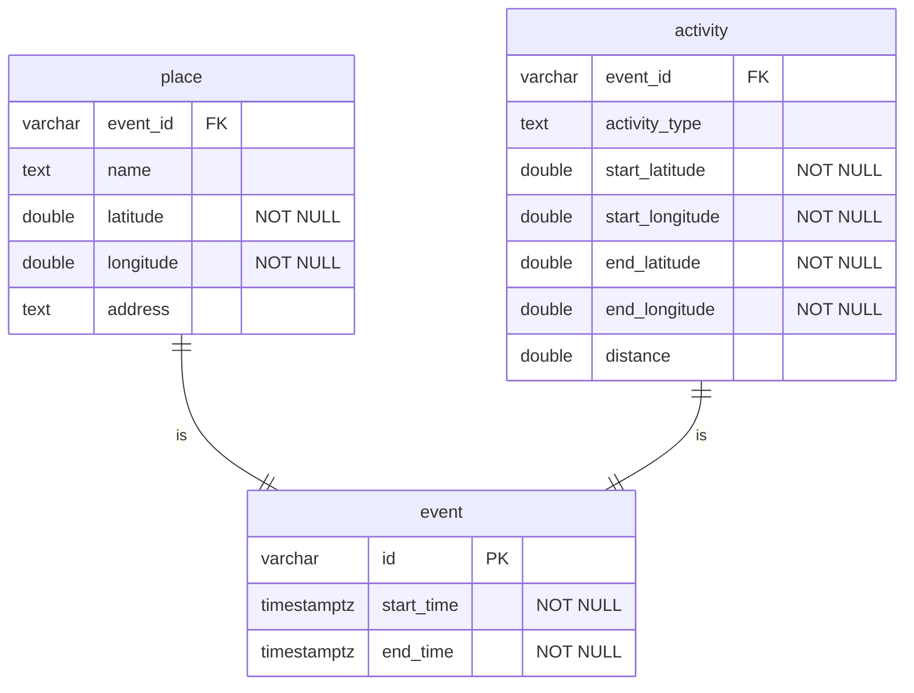

# Google Map Timeline Search Demo App

## Setup

1. Download your GoogleMaps timeline data (Takeout) from <https://timeline.google.com/maps/timeline>
1. Extract downloaded `.zip` or `.gz` file into `./Takeout` directory
1. Make sure Location History data (`.json`) is contained on downloaded takeout.

### Postgres

- psql (PostgreSQL) 14.4
- create database tables

```shell
createdb gmap_demo_app
psql gmap_demo_app < setup.sql
```



### Python Enviroment

- Python=3.10.4
- pip=21.2.4

```shell
pip install -r requirments.txt
```

copy  `env.json.sample` into `env.json` then set attributes, then run

```shell
python db.py
```

create database from Takeout data

check database info

```shell
% psql gmap_demo_app
psql (14.4)
Type "help" for help.

gmap_demo_app=#  \conninfo
```

and run Streamlit server

```shell
streamlit run run.py
```

## Notes

- this demo app is developeed as a assignment on MMKB class at Keio Univ. grad school of media and governance.
